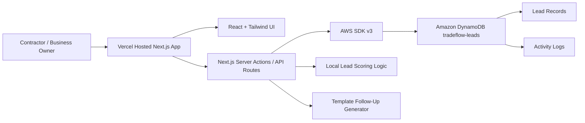

# TradeFlow Lite

TradeFlow Lite is a zero-cost hackathon MVP for **H0: Hack the Zero Stack with Vercel v0 and AWS Databases**.

Track: **Monetizable B2B App**

## Problem

Small contractors lose money because leads arrive from phone calls, referrals, websites, Facebook, Google, and email, but they do not have a simple follow-up system. They forget urgent jobs, miss follow-ups, and cannot clearly see revenue in the pipeline.

## Solution

TradeFlow Lite turns every contractor inquiry into a structured sales opportunity with lead capture, local lead scoring, pipeline tracking, follow-up checklists, proposal-ready summaries, and a revenue dashboard.

## Features

- Polished SaaS landing page
- Contractor CRM dashboard
- Add lead workflow
- Local TypeScript lead scoring
- Hot, warm, and cold temperature badges
- Pipeline board: New, Qualified, Proposal Sent, Won, Lost
- Lead detail panel with follow-up plan and proposal summary
- Revenue metrics and follow-up metrics
- Demo seed data
- DynamoDB persistence with mock fallback mode
- Architecture page for Devpost screenshots
- Submission helper page with copy-ready text

## Tech Stack

- Next.js App Router
- TypeScript
- Tailwind CSS
- shadcn-style local UI components
- Lucide icons
- AWS SDK v3
- Amazon DynamoDB
- Optional Amazon Aurora DSQL backend
- Vercel-compatible deployment

## AWS Database Used

Amazon DynamoDB stores lead and activity records.

Table name: `tradeflow-leads`

Billing mode: `On-demand`

Primary key:

- Partition key: `PK` string
- Sort key: `SK` string

## DynamoDB Schema

Single-table design:

| Entity | PK | SK |
| --- | --- | --- |
| Lead | `TENANT#demo` | `LEAD#<leadId>` |
| Activity | `TENANT#demo` | `ACTIVITY#<timestamp>#<activityId>` |

Lead attributes:

- `leadId`
- `customerName`
- `contact`
- `serviceType`
- `urgency`
- `dealValue`
- `leadSource`
- `notes`
- `score`
- `temperature`
- `status`
- `followUpDate`
- `createdAt`
- `updatedAt`

## Architecture



## Environment Variables

Copy `.env.example` to `.env.local` for local development:

```bash
AWS_REGION=us-east-1
AWS_ACCESS_KEY_ID=your_access_key_here
AWS_SECRET_ACCESS_KEY=your_secret_key_here
DYNAMODB_TABLE_NAME=tradeflow-leads
```

Never commit `.env.local`.

If these variables are missing, the app runs in mock mode and shows this banner:

> Demo mode: no DynamoDB or Aurora DSQL database environment variables are configured.

### Optional Aurora DSQL Backend

The original hackathon requirement is DynamoDB, so DynamoDB remains the default. Aurora DSQL can be enabled as an optional serverless distributed SQL backend by setting:

```bash
DATABASE_BACKEND=dsql
AWS_REGION=us-east-1
AWS_ACCESS_KEY_ID=your_access_key_here
AWS_SECRET_ACCESS_KEY=your_secret_key_here
DSQL_CLUSTER_ENDPOINT=your-cluster-id.dsql.us-east-1.on.aws
DSQL_REGION=us-east-1
DSQL_DATABASE=postgres
DSQL_DB_USER=admin
```

Cost note: Aurora DSQL currently has an AWS Free Tier allowance, but usage above the allowance can create charges. Keep the demo small, monitor AWS Billing, and delete unused clusters.

The app creates these DSQL tables automatically on first use:

```sql
CREATE TABLE IF NOT EXISTS tradeflow_leads (...);
CREATE TABLE IF NOT EXISTS tradeflow_activity (...);
```

## Local Setup

```bash
npm install
npm run dev
```

Open `http://localhost:3000`.

## Create the DynamoDB Table

In the AWS Console:

1. Open DynamoDB.
2. Choose **Create table**.
3. Table name: `tradeflow-leads`
4. Partition key: `PK`, type `String`
5. Sort key: `SK`, type `String`
6. Table settings: choose **Customize settings** if needed.
7. Billing mode: **On-demand**
8. Create table.

For AWS CLI:

```bash
aws dynamodb create-table \
  --table-name tradeflow-leads \
  --attribute-definitions AttributeName=PK,AttributeType=S AttributeName=SK,AttributeType=S \
  --key-schema AttributeName=PK,KeyType=HASH AttributeName=SK,KeyType=RANGE \
  --billing-mode PAY_PER_REQUEST \
  --region us-east-1
```

## Optional: Create an Aurora DSQL Cluster

AWS CLI is installed on this machine at:

```powershell
& 'C:\Program Files\Amazon\AWSCLIV2\aws.exe' --version
```

It is not currently configured in this shell. Configure credentials first:

```powershell
& 'C:\Program Files\Amazon\AWSCLIV2\aws.exe' configure
```

Then list or create DSQL clusters:

```powershell
& 'C:\Program Files\Amazon\AWSCLIV2\aws.exe' dsql list-clusters --region us-east-1

& 'C:\Program Files\Amazon\AWSCLIV2\aws.exe' dsql create-cluster `
  --no-deletion-protection-enabled `
  --tags project=tradeflow-lite,purpose=hackathon-demo `
  --region us-east-1
```

After creation, copy the DSQL endpoint into `DSQL_CLUSTER_ENDPOINT` and set `DATABASE_BACKEND=dsql` in Vercel Project Settings.

## Deployment to Vercel

1. Push this repo to GitHub.
2. Import it into Vercel.
3. Add the DynamoDB environment variables in Vercel Project Settings, or the optional DSQL variables if using DSQL.
4. Deploy.

No paid APIs, AI APIs, authentication, Stripe, custom domain, or external services are required.

## Demo Flow

1. Open the landing page.
2. Click **Open Demo Dashboard**.
3. Seed demo leads if the board is empty.
4. Add a contractor lead.
5. Show the calculated score and temperature.
6. Open the lead detail panel.
7. Show the follow-up checklist and proposal summary.
8. Move the lead through statuses.
9. Show revenue metrics updating.
10. Open the architecture page and explain DynamoDB persistence.

## Monetization

TradeFlow Lite is designed as a **$49/month SaaS** for small contractor businesses that need simple lead follow-up and pipeline visibility before they need a full CRM.

## Future Roadmap

- Multi-tenant accounts
- Email and SMS reminders
- Calendar scheduling
- CSV import
- Mobile-first technician view
- Quote templates by trade
- Optional invoice and payment integrations
