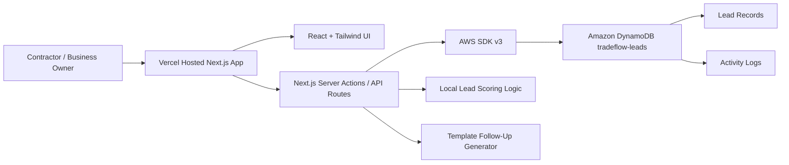

# TradeFlow Lite

Track: **Monetizable B2B App**

AWS Database: **Amazon DynamoDB**

Optional experimental backend: **Amazon Aurora DSQL**

## Description

TradeFlow Lite is a monetizable B2B app for local contractors. It helps garage door companies, HVAC businesses, roofers, plumbers, electricians, and other service businesses stop losing revenue from missed follow-ups.

## Problem

Small contractors often manage leads across calls, emails, referrals, websites, and social media messages. Without a simple pipeline, they lose track of urgent jobs and forget follow-ups.

## Solution

TradeFlow Lite captures every lead, scores it based on urgency and deal value, creates a follow-up plan, and tracks the opportunity through a pipeline from new lead to won job.

## Why DynamoDB

DynamoDB was chosen because it is serverless, free-tier friendly for a hackathon MVP, fast for lead capture workflows, and scalable for a future multi-tenant SaaS product.

## Monetization

The app could be sold as a **$49/month SaaS** tool for small contractor businesses.

## Architecture

Vercel hosts the Next.js frontend and backend routes. The app uses AWS SDK v3 to read and write lead records to Amazon DynamoDB using a single-table design.

## Technical Implementation

- Next.js App Router with TypeScript
- Tailwind CSS and shadcn-style UI components
- Lucide icons
- AWS SDK v3
- Amazon DynamoDB table: `tradeflow-leads`
- Optional Aurora DSQL tables: `tradeflow_leads` and `tradeflow_activity`
- Single-table keys: `PK` and `SK`
- Mock mode when database environment variables are missing
- Local TypeScript lead scoring and template-generated follow-up plans

## Demo Script

1. Open the landing page and describe the missed follow-up problem.
2. Click **Open Demo Dashboard**.
3. Seed demo leads if the dashboard is empty.
4. Add a new emergency contractor lead.
5. Show the calculated lead score and Hot/Warm/Cold badge.
6. Open the lead detail panel and show the follow-up checklist.
7. Show the proposal-ready summary.
8. Move the lead through the pipeline.
9. Show revenue metrics updating.
10. Open the architecture page and explain Vercel, Next.js API routes, AWS SDK v3, and DynamoDB.

## Future Roadmap

- Multi-tenant contractor accounts
- Follow-up reminders
- Calendar scheduling
- Trade-specific quote templates
- CSV import
- Mobile-first technician workflow
